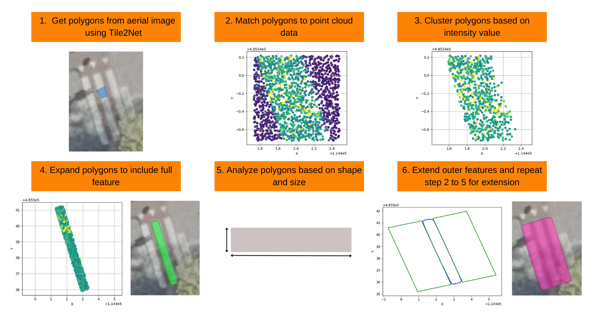

# Where (not) to Cross the Street

This repository contains the code related to the MSc thesis Where (not) to Cross the Street: automatically detecting crosswalks for accessible navigation. The thesis introduces a method to refine crosswalk polygons from automatic crosswalk detection methods by using 3D LiDAR point clouds. Effectively, the framework attempts to remove false positive polygons and makes true positive polygons more accurate in their shape and size.



The framework consists of 6 steps.

1. Get crosswalk polygons from the existing tool (such as Tile2Net).
2. Match the crosswalk polygons to the point cloud data.
3. Filter out points that do not meet a certain intensity threshold and cluster the remaining points based on spatial proximity.
4. Expand the clusters to include the full feature they capture.
5. Analyze the expanded clusters to see if they match the shape and size of a crosswalk stripe and remove clusters that do not meet the requirements.
6. Extend the outer clusters of each crosswalk polygon and repeat step 3 to 5 to see if any stripes were missed. 

Finally, the clusters that stem from the same original polygon are merged together to create the final output crosswalk polygons.

## Folder Structure

* [`data/input`](./data/input): Sample data for demo purposes. 
* [`data/output`](./data/output): Folder to save demo output. 
* [`notebooks`](./notebooks): Jupyter notebooks / tutorials.

## Installation 

1) Clone this repository:


```bash
git clone https://github.com/AmsterdamInternships/where not to cross the street.git
```


2) Install all dependencies:
    


```bash
pip install copy
pip install geopandas
pip install interruptingcow
pip install laspy
pip install math
pip install matplotlib.pyplot
pip install numpy
pip install open3d
pip install pandas
pip install pickle
pip install re
pip install scipy.spatial
pip install shapely
pip install sklearn.cluster
```

The code has been tested with Python 3.9 on Windows. 

## How it works

All code can be run in the notebooks. The notebooks are numbered in the order of usage but it is important to note that after running notebook 3, notebook 2 has to be run again with the output of notebook 2. This is specified in the notebooks as well. Furthermore, each notebook contains information on what it does and its input and output.

### input
- Shapely file with crosswalk polygons to be processed. In the demo these are produced using the open source tool Tile2Net (https://github.com/VIDA-NYU/tile2net).
- Point clouds in .laz or .las format that cover the area where the crosswalk polygons are taken from. These should be cut into files that cover 50 by 50 meter that are marked by the coordinates of the lower left corner following the Dutch Rijksdriehoeksstelsel. The tile code is generated as [X-coordinate/50]_[Y-coordinate/50]. For example, file 2386_9702 corresponds to (119300, 485100) in RD coordinates.

### output
- Shapely file with processed crosswalk polygons.

## Contributing


Feel free to help out! [Open an issue](https://github.com/AmsterdamInternships/where not to cross the street/issues), submit a [PR](https://github.com/AmsterdamInternships/where not to cross the street/pulls)  or [contact us](https://amsterdamintelligence.com/contact/).


## Acknowledgements


This repository was created in collaboration with [Amsterdam Intelligence](https://amsterdamintelligence.com/) for the City of Amsterdam.


## License 

This project is licensed under the terms of the European Union Public License 1.2 (EUPL-1.2).
